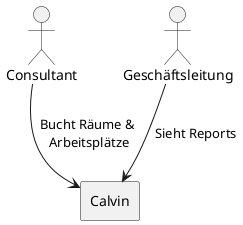
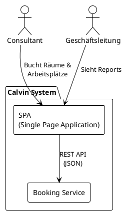

# Architekturdokumentation Calvin

---

## Einführung und Ziele

### Aufgabenstellung

Calvin ist INNOQs internes Raum- und Arbeitsplatzbuchungssystem zur Verwaltung von Ressourcen an 8 Bürostandorten (Monheim, Berlin, Hamburg, Köln, München, Zürich, Cham, Offenbach).

#### Treibende Kräfte

- INNOQ hat bisher kein dediziertes Buchungssystem
- Hybrides Arbeiten erfordert zuverlässige Arbeitsplatzkoordination
- Vermeidung von Ressourcenkonflikten und Doppelbuchungen

Für die vollständige Produktbeschreibung und Features siehe [Produktvision](../produkt/produktvision.md).

### Qualitätsziele

Die folgenden Qualitätsziele haben die höchste Priorität für die Architektur von Calvin. Die vollständigen Qualitätsszenarien sind in [Qualitätsanforderungen](../architektur/qualitätsanforderungen.md) dokumentiert.

| Priorität | Qualitätsziel | Szenario |
|-----------|---------------|----------|
| 1 | **Zuverlässigkeit** | Doppelbuchungen werden in 99 % der Fälle serverseitig verhindert, auch bei gleichzeitigen Buchungsversuchen innerhalb derselben Sekunde. |
| 2 | **Performance** | Suchergebnisse für verfügbare Räume werden innerhalb von 500 ms angezeigt, auch bei 150 gleichzeitigen Nutzern. |
| 3 | **Benutzbarkeit** | Neue Mitarbeiter können ohne Schulung ihre erste Buchung in maximal 3 Minuten abschließen. 80 % schaffen dies ohne Hilfe. |
| 4 | **Verfügbarkeit** | 98 % Verfügbarkeit während der Kernarbeitszeiten (8:00–18:00 Uhr). Bei Ausfall Wiederherstellung innerhalb von 30 Minuten. |

### Stakeholder

| Rolle | Erwartungshaltung |
|-------|-------------------|
| **INNOQ Mitarbeiter** | Einfache, schnelle Buchung von Räumen und Arbeitsplätzen. Übersicht wer im Büro sein wird. |
| **INNOQ Geschäftsführung** | Überblick über Büroauslastung als Basis für Standortstrategie (Büros verkleinern, schließen oder an anderen Standorten eröffnen). Hohe Mitarbeiterakzeptanz. |

---

## Kontextabgrenzung

### Überblick

Das Calvin-System ist INNOQs internes Raum- und Arbeitsplatzbuchungssystem. Das System operiert in einem minimalen Systemkontext.

### Fachlicher Kontext

---

## Bausteinsicht

### Ebene 1: Whitebox Gesamtsystem

Das Calvin-System besteht aus einer Single Page Application (SPA) und einem separaten Booking Service. Diese Architektur wurde für die Prototyping-Phase optimiert und ermöglicht eine klare Trennung zwischen Benutzeroberfläche und Geschäftslogik.

### Enthaltene Bausteine

| Baustein | Verantwortlichkeit | Quellcode |
|----------|-------------------|-----------|
| **SPA** | Benutzeroberfläche für Buchungen, Kalenderansichten und Reports; enthält statische Mock-Daten für Standorte, Konferenzräume und Ausstattungen (Prototyp) | `frontend/` |
| **Booking Service** | Buchungslogik, Validierung, Konfliktprüfung, Auswertungsdaten | `backend/` |

### Schnittstelle: SPA → Booking Service

Die SPA kommuniziert mit dem Booking Service über eine REST API (JSON über HTTPS). Die API-Spezifikation wird als OpenAPI-Dokument im Backend gepflegt.

> **Prototyp-Einschränkungen**: Standort-, Konferenzraum- und Ausstattungsdaten sind als Mock-Daten in der SPA hinterlegt (kein separater Ressource-Service). Die Authentifizierung erfolgt über Basic-Auth ohne Passwörter. Beide Punkte sind als technische Schulden dokumentiert und werden vor dem Produktivbetrieb abgelöst. Siehe [Technische Schulden](../architektur/technische-schulden.md).

---

## Architekturentscheidungen

Architekturentscheidungen sind als Architecture Decision Records (ADR) dokumentiert.

| ADR | Titel | Status |
|-----|-------|--------|
| [ADR-001](adrs/ADR-001-frontend-prototyp-und-booking-service.md) | Frontend-Prototyp mit separatem Booking Service | Akzeptiert |
| [ADR-0001](../architektur/adrs/ADR-0001-technologie-stack-fuer-booking-service.md) | Technologie-Stack für den Booking Service | Akzeptiert |
| [ADR-0002](../architektur/adrs/ADR-0002-ressourcedaten-als-mock-daten-in-der-spa.md) | Ressourcedaten als Mock-Daten in der SPA | Akzeptiert |
| [ADR-0003](../architektur/adrs/ADR-0003-basic-auth-ohne-passwort-fuer-prototyp.md) | Basic-Auth ohne Passwörter statt Okta für den Prototypen | Akzeptiert |

---

## Qualitätsanforderungen

Die vollständigen Qualitätsszenarien sind in der dedizierten Datei [Qualitätsanforderungen](../architektur/qualitätsanforderungen.md) dokumentiert.

---

## Glossar

Das Glossar findest du unter [/docs/produkt/glossar.md](/docs/produkt/glossar.md).
